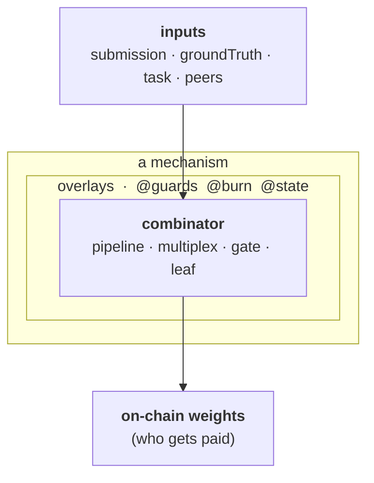

```mermaid
flowchart TB
    inputs["<b>inputs</b><br/>submission · groundTruth · task · peers"]
    subgraph mech["a mechanism"]
        direction TB
        subgraph ov["overlays&nbsp;&nbsp;·&nbsp;&nbsp;@guards&nbsp;&nbsp;@burn&nbsp;&nbsp;@state"]
            comb["<b>combinator</b><br/>pipeline · multiplex · gate · leaf"]
        end
    end
    weights["<b>on-chain weights</b><br/>(who gets paid)"]
    inputs --> comb
    comb --> weights
```
