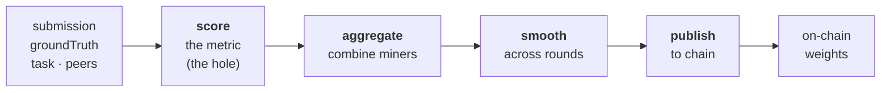
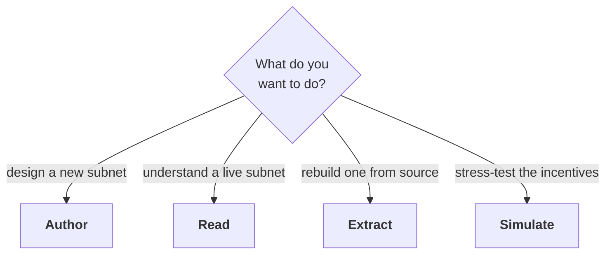

# The mental model

If you remember one picture, remember this one. Everything in IMML — the language, the reference, the
examples, the simulator — is built around it.

> **A mechanism is a combinator, wrapped in overlays, turning inputs into on-chain weights.**

--8<-- "docs/_snippets/diagram-anatomy.md"

That's the whole shape. The rest of this page unpacks the three boxes. None of it requires you to have
read anything else; unfamiliar words link to the [glossary](../reference/glossary.md).

## 1. The inputs

Every mechanism scores miners from the same four things:

| input | what it is |
| --- | --- |
| `submission` | what a miner sent in (a prediction, a file, an answer…) |
| `groundTruth` | the source of truth to score against (a dataset, a reference, human review…) |
| `task` | what was asked of the miner this round |
| `peers` | what the *other* miners submitted (needed for ranking / relative scoring) |

## 2. The combinator — how scores are computed

The **[combinator](../reference/glossary.md)** is the skeleton of the mechanism. There are only four
shapes, and **89% of real subnets are the first one**:

- **`pipeline`** — the common case: a single line of work, `score → aggregate → smooth → publish`.
- **`multiplex`** — several scoring tracks run in parallel, then combined.
- **`gate` / `product`** — a hard requirement multiplies the rest (fail it and you score zero).
- **`leaf`** — a bare metric with no surrounding structure.

The `pipeline` is four stages in order. Inputs enter at the left; on-chain weights leave at the right:

| stage | the question it answers | examples |
| --- | --- | --- |
| `score` | how good is one miner's submission? | accuracy, a Brier score, a win-rate… |
| `aggregate` | how do per-miner scores become a weight vector? | proportional, winner-take-all, rank-based… |
| `smooth` | how much do we trust this round vs history? | EMA, none… |
| `publish` | how and when do weights hit the chain? | `set_weights`, per-epoch cadence… |

!!! note "Why `score` is special — the hole"
    Three of the four stages are drawn from a small, **reusable** vocabulary — every subnet aggregates,
    smooths, and publishes in one of a handful of known ways. The `score` stage is different: the *metric*
    is bespoke to each subnet and does not recur. IMML makes that the one explicit **hole** in the design,
    rather than pretending it generalizes. That single idea is the [whole reason IMML exists](why.md).

## 3. The overlays — cross-cutting rules

Overlays wrap the combinator and change the whole thing at once:

- **`@guards`** — anti-gaming rules (dedup, deterministic checks, commit-reveal, collateral…). A guard can
  reject, penalize, or barrier a submission.
- **`@burn`** — sends a fraction of emission to nobody (burns it) instead of paying miners.
- **`@state`** — per-miner memory the mechanism carries between rounds.

## Which path are you on?

IMML serves three different jobs. Pick the one that matches what you're doing:

- **Author** — you're designing a mechanism. Start with the [tutorial](tutorial/index.md), then the
  [authoring guide](../guides/author.md).
- **Read** — you want to understand an existing subnet. Browse the [examples gallery](../examples/index.md);
  every one of the 189 subnets is lifted to IMML with a dataflow diagram.
- **Extract** — you're reverse-engineering a subnet from its source. See the
  [extraction guide](../guides/extract.md).
- **Simulate** — you want to know if a mechanism actually holds up against strategic miners. See
  [the simulator](../understand/simulator.md).

---

Ready to build one end to end? **[Start the tutorial →](tutorial/index.md)**
